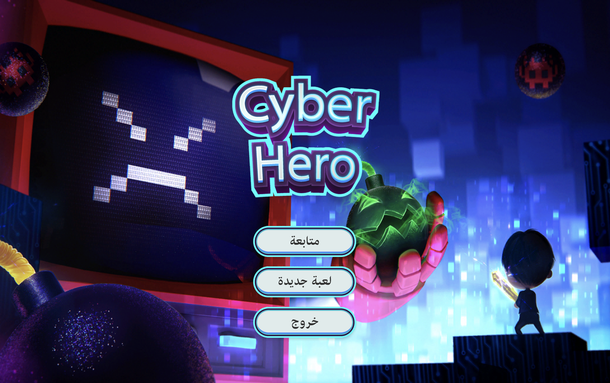
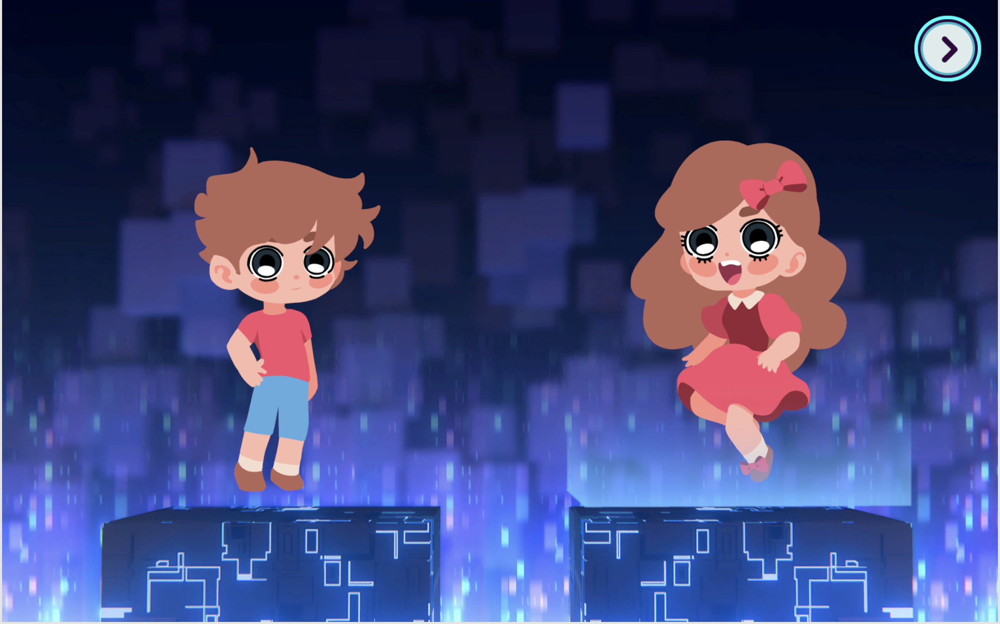
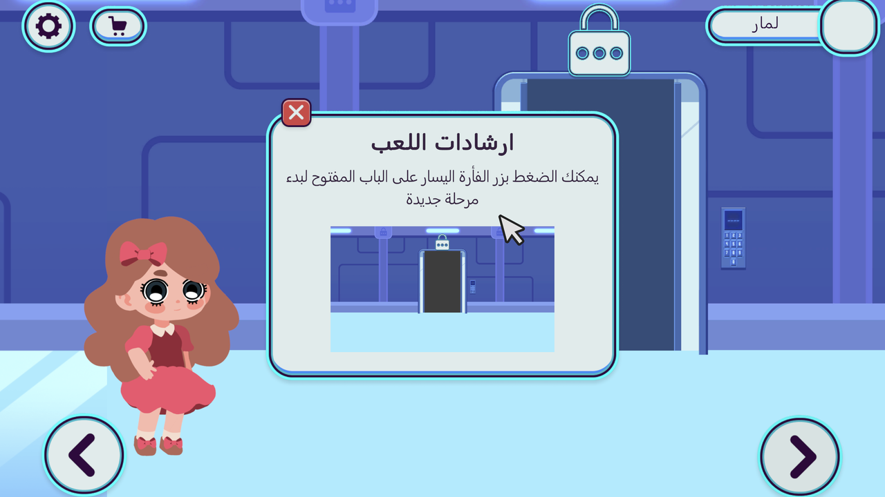
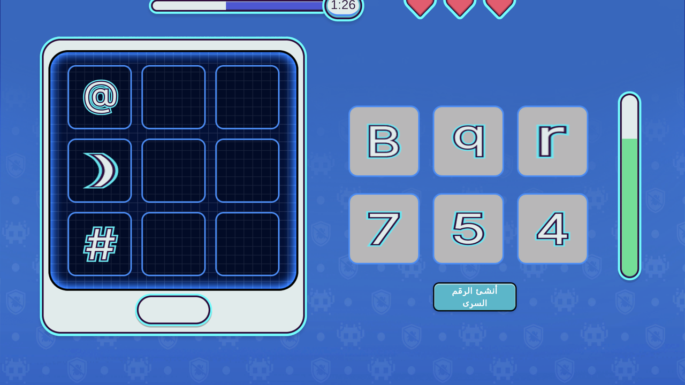
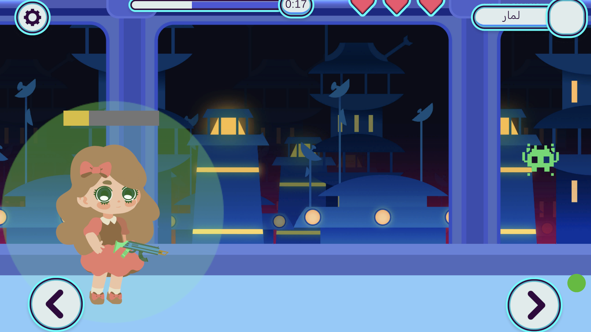
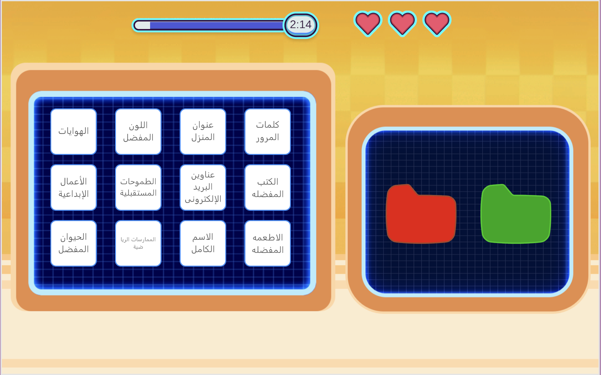
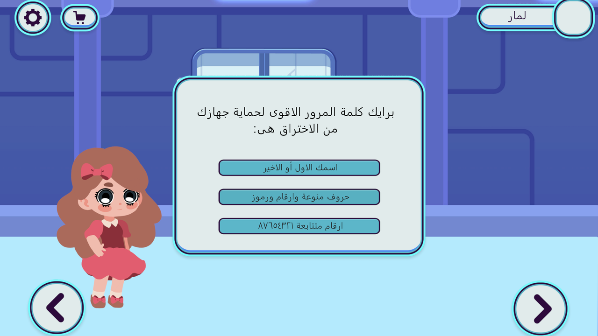
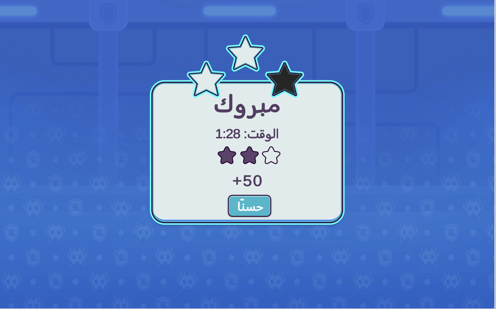
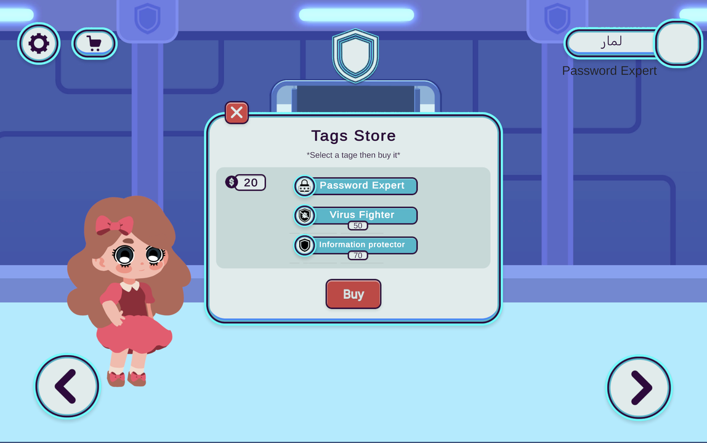
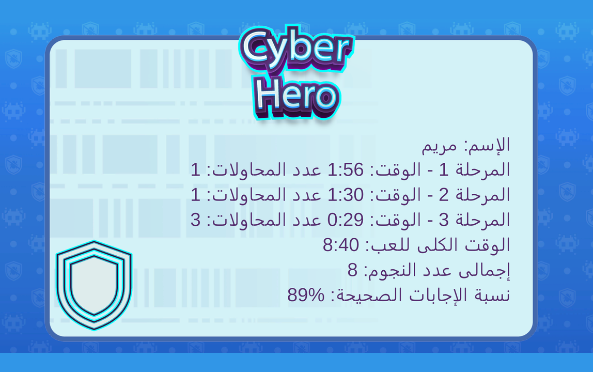

<div align="center">



# Cyber Hero

**An Arabic educational game that teaches children the basics of staying safe online.**


**[⬇ Download for macOS](../../releases/latest)**

</div>

---

## About

Cyber Hero teaches children three online safety concepts — not by explaining them, but by making players *do* them, so the lesson comes out of the mechanic rather than out of a text box.

Each stage is a different genre, chosen so the interaction itself carries the idea. A robot guide introduces every challenge, the whole game is voiced and written in Arabic, and players pick a character before starting.

<div align="center">
  
  
</div>

Progress runs through a central hub — a locked door whose icons unlock as each stage is cleared.

## The stages

### 1 · Building a strong password



Characters are collected around the level and dragged into the slots of a tablet. A strength meter fills as the password gains variety, and the "create password" button only accepts a combination containing an uppercase letter, a lowercase letter, a number and a symbol.

Characters are reshuffled on every retry, so a failed attempt can't be solved by repeating a memorized sequence — the player has to apply the rule rather than the answer.

**The lesson:** why mixing character types is what makes a password strong.

### 2 · Firewall and antivirus



Viruses advance on the player, who shoots them down while a shield holds them off. The shield expires, and a fresh one has to be collected before the next wave.

The two mechanics are deliberately separate — a shield that *blocks* and a weapon that *removes* — because they represent two separate tools. A single "defence" mechanic would have collapsed the distinction the stage exists to teach.

**The lesson:** the difference between a firewall and an antivirus.

### 3 · What not to share



Cards of personal information are sorted into two folders: green for things that are fine to share, red for things that aren't. Hobbies, favourite food and favourite animal go one way; full name, parents' names, email addresses and health information go the other. A monster attacks when something private lands in the green folder.

**The lesson:** which personal information should stay private.

### 4 · The quiz



Three questions per completed stage. Answering most of them correctly unlocks the way forward; failing sends the player back to revisit the material. Questions are authored as data assets rather than in code, so wording can be revised without a rebuild.

## Progression

<div align="center">
  
  
</div>

Every stage shares one layer: instructions before entry, a countdown timer, three hearts, and stars and coins awarded on completion time and accuracy. Losing all hearts replays the stage rather than ending the run — the audience is children, and a hard fail state teaches nothing.

Coins buy cosmetic name tags — *Password Expert*, *Virus Fighter*, *Information Protector* — which display beside the player's name.

## Certificate and report



Finishing the game issues a personalized certificate with the player's name, per-stage time and attempt count, total playtime, stars earned and quiz accuracy. The same figures are sent to analytics, making it possible to see where players actually struggle rather than guessing.

## Under the hood

The three gameplay stages are genuinely different games — drag-and-drop, a shooter, and a sorting puzzle — sharing one progression system. Each stage owns a `StageNRules` component holding only its own logic, while lives, timing, scoring, dialogue and scene flow live in a persistent `GameManager` that knows nothing about how any individual stage plays.

Full write-up: **[docs/ARCHITECTURE.md](docs/ARCHITECTURE.md)**

## Problems worth reading about

Two decisions that shaped the whole project — running three distinct genres under one progression system, and getting Arabic to render correctly in Unity:

**[docs/CHALLENGES.md](docs/CHALLENGES.md)**

## Running it

Download the latest macOS build from [Releases](../../releases/latest). A Windows build is planned.

To build from source:

```bash
git clone https://github.com/we-dad/Cyber-Security-Game.git
```

Open in Unity and load the main menu scene. PlayFab needs a title ID in its settings asset before accounts will connect; the game is otherwise playable offline.

Tests live in `Assets/EditModeTests` and `Assets/PlayModeTests` and run from **Window → General → Test Runner**.

> **Note on the browser build.** The game is not built for WebGL. Saved progress, accounts and cloud features depend on platform APIs that a browser build cannot reach, so it ships as a native desktop application instead.

## Built with

| | |
|---|---|
| **Unity 2D** | Engine |
| **PlayFab** | Accounts, player data, analytics |
| **RTLTMPro / ArabicSupport** | Arabic text shaping and RTL layout |
| **Unity Test Framework** | EditMode and PlayMode tests |
| **ScriptableObjects** | Quiz question and tag data |
